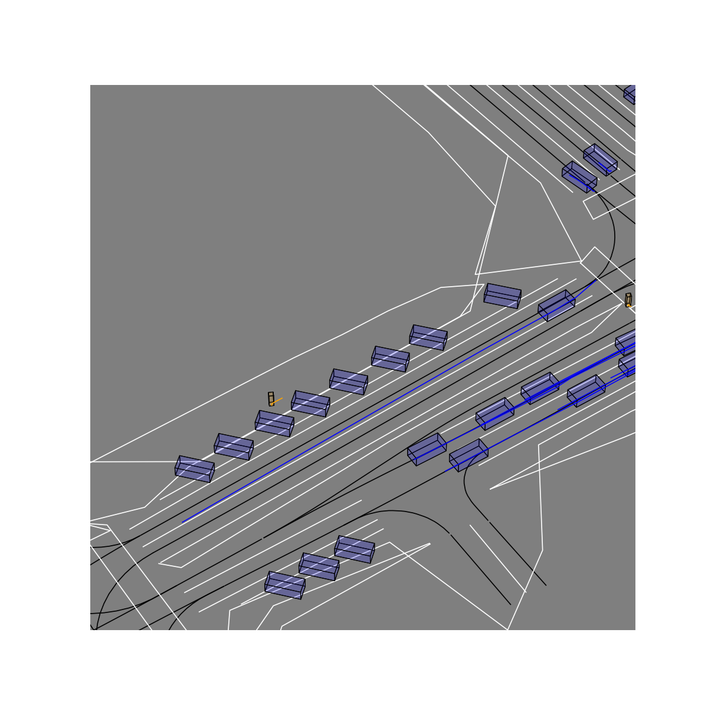
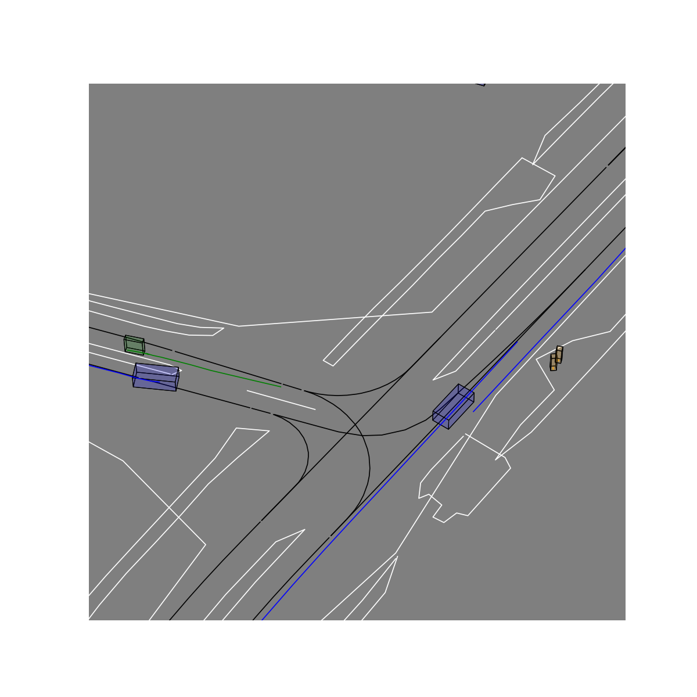

# unitraj2hptr

<p align="justify">
Converts the h5 data from <a href="https://github.com/vita-epfl/UniTraj">Unitraj</a> (based on <a href="https://github.com/metadriverse/scenarionet">ScenarioNet</a>) to the <a href="https://github.com/zhejz/HPTR">HPTR</a> data format.
</p>

## Installing

<p align="justify">
This tool can be installed by running the following commands:

```bash
conda create -n unitraj2hptr python=3.9.21
git clone https://github.com/marlon31415/unitraj2hptr.git
cd unitraj2hptr
pip install -e .
```
</p>

## Preparing data

<p align="justify">
The conversion script expects <code>.h5</code> Unitraj cache files as input. The <a href="https://github.com/vita-epfl/UniTraj">original Unitraj repo</a> converts the agent and map data to local coordinates. As <a href="https://github.com/zhejz/HPTR">HPTR</a> expects global coordinates, we implemented a set of modifications necessary for the conversion pipeline which can be found in the <a href="https://github.com/JVPC0D3R/UniTraj">modified Unitraj repo</a>.
</p>


To preprocess the data follow this steps:

1. Install our [modified ScenarioNet](https://github.com/JVPC0D3R/scenarionet) and convert data:

2. Install our [modified Unitraj](https://github.com/JVPC0D3R/UniTraj) and generate cache files

3. Run the conversion script:

```bash
python convert.py --dataset split_to_convert --hptr_root_dir /path/to/hptr/output --unitraj_data_dir /path/to/input/data
```

## Plotting

<p align="justify">
The conversion tool allows plotting scenarios while converting data, to activate this feature  run:
</p>

```bash
python convert.py --dataset split_to_convert --hptr_root_dir /path/to/hptr/output --unitraj_data_dir /path/to/input/data --save_plots
```


<p align="center">
  
  
  
</p>
<p align="center">
  <em>NuScenes examples of default mode scenario <a href="https://github.com/zhejz/HPTR">HPTR</a>  outputs.</em>
</p>